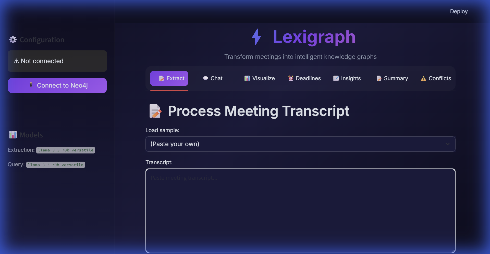
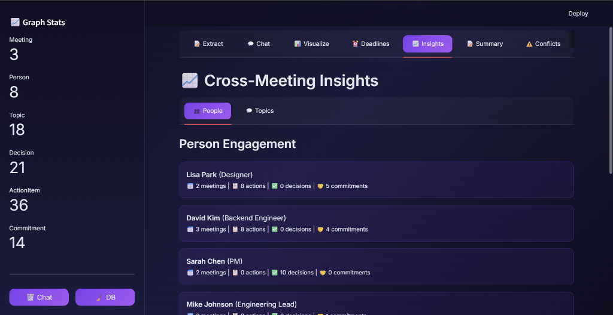
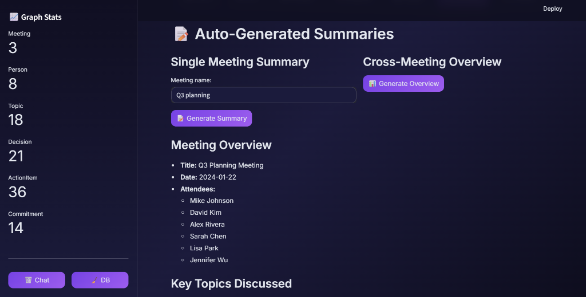
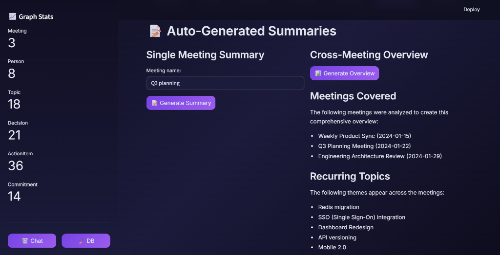

# ⚡ Lexigraph

**Transform meetings into intelligent knowledge graphs**

A premium 3-agent AI system that extracts structured intelligence from meeting transcripts and builds a queryable Neo4j knowledge graph with conversational interface.


<p align="center">
  
</p>

## 📸 Screenshots

<table>
  <tr>
    <td align="center"><br><b>Deadline Tracker</b></td>
    <td align="center"><br><b>Person Engagement</b></td>
  </tr>
  <tr>
    <td align="center"><br><b>Single Meeting Summary</b></td>
    <td align="center"><br><b>Cross-Meeting Overview</b></td>
  </tr>
  <tr>
    <td align="center"><br><b>Conflict Detection</b></td>
    <td align="center"><br><b>Topic Trends</b></td>
  </tr>
</table>

---

## Features

### Core Intelligence
- **Entity Extraction** - LLM extracts people, topics, decisions, action items, and commitments
- **Knowledge Graph** - Neo4j stores entities with semantic relationships
- **Conversational Chat** - Ask questions with follow-up memory ("What should Mike do?" → "What about his deadlines?")

### Advanced Analytics
- **Interactive Graph Visualization** - PyVis-powered network with filter buttons by node type
- **Deadline Tracker** - Dashboard showing overdue, due soon, and upcoming action items
- **Cross-Meeting Insights** - Topic trends and person engagement metrics
- **Auto-Generated Summaries** - One-click executive summaries for single or multiple meetings
- **Conflict Detection** - LLM-powered analysis to flag contradicting decisions

---

## Architecture

```
┌─────────────────┐     ┌─────────────────┐     ┌─────────────────┐
│   Extractor     │────▶│  Graph Builder  │────▶│   Query Agent   │
│     Agent       │     │      Agent      │     │                 │
└─────────────────┘     └─────────────────┘     └─────────────────┘
        │                       │                       │
        ▼                       ▼                       ▼
   Groq LLM              Neo4j Graph              Groq LLM
 (Llama 3.3 70B)        (Knowledge DB)         (Text-to-Cypher)
```

| Agent | Purpose |
|-------|---------|
| **Extractor** | Parses transcripts → structured entities (Pydantic models) |
| **Graph Builder** | Creates Neo4j nodes + relationships with fuzzy matching |
| **Query Agent** | Converts natural language → Cypher queries → answers |
| **Analyzer** | Cross-meeting insights, deadline tracking, conflict detection |
| **Summary Agent** | Generates executive summaries from graph data |

---

## Quick Start

### Prerequisites
- Python 3.9+
- Neo4j Desktop or Docker
- Groq API key (free at [console.groq.com](https://console.groq.com))

### Installation

```bash
# Clone the repository
git clone https://github.com/yourusername/lexigraph.git
cd lexigraph

# Create virtual environment
python -m venv venv
source venv/bin/activate  # Windows: venv\Scripts\activate

# Install dependencies
pip install -r requirements.txt

# Configure environment
cp .env.example .env
# Edit .env with your credentials
```

### Configuration

Edit `.env` with your credentials:

```env
GROQ_API_KEY=your_groq_api_key
NEO4J_URI=bolt://localhost:7687
NEO4J_USERNAME=neo4j
NEO4J_PASSWORD=your_password
EXTRACTION_MODEL=llama-3.3-70b-versatile
QUERY_MODEL=llama-3.3-70b-versatile
```

### Run the App

```bash
streamlit run app.py
```

Open http://localhost:8501 in your browser.

---

## 🚀 Cloud Deployment

### Deploy to Streamlit Cloud (Free)

1. **Push to GitHub** - Ensure your code is on GitHub

2. **Create Neo4j AuraDB** (free tier):
   - Go to [console.neo4j.io](https://console.neo4j.io)
   - Create a free AuraDB instance
   - Save the connection URI and password

3. **Deploy on Streamlit Cloud**:
   - Go to [share.streamlit.io](https://share.streamlit.io)
   - Connect your GitHub repo
   - Set main file: `app.py`
   - Add secrets in Advanced Settings:
     ```toml
     NEO4J_URI = "neo4j+s://xxxxx.databases.neo4j.io"
     NEO4J_USER = "neo4j"  
     NEO4J_PASSWORD = "your-aura-password"
     GROQ_API_KEY = "gsk_xxxxx"
     ```

4. **Migrate Local Data** (optional):
   ```bash
   # Add to .env:
   AURA_URI=neo4j+s://xxxxx.databases.neo4j.io
   AURA_PASSWORD=your-aura-password
   
   # Run migration:
   python migrate_to_aura.py
   ```

> **Note**: Graph Intelligence (Node2Vec) features require C++ compilation and work locally only.

---

## Usage Guide

### 1. Connect to Neo4j
Click "Connect to Neo4j" in the sidebar to establish connection.

### 2. Extract & Build
- Go to the **Extract** tab
- Select a sample transcript or paste your own
- Click **Extract & Build** to process

### 3. Chat with Your Meetings
- Go to the **Chat** tab
- Ask questions like:
  - "What decisions were made?"
  - "What should Mike do?"
  - "What are the deadlines for this week?"

### 4. Explore Visualizations
- **Visualize** - Interactive graph with filter checkboxes
- **Deadlines** - Action items categorized by urgency
- **Insights** - Topic trends and person engagement
- **Summary** - Auto-generated meeting summaries
- **Conflicts** - Decision conflict analysis

---

## Tech Stack

| Technology | Purpose |
|------------|---------|
| **LangChain** | LLM orchestration and prompt management |
| **Groq** | Fast LLM inference (Llama 3.3 70B) |
| **Neo4j** | Graph database for knowledge storage |
| **Streamlit** | Premium dark-mode UI |
| **PyVis** | Interactive graph visualization |
| **Pydantic** | Structured data validation |

---

## Project Structure

```
lexigraph/
├── app.py                    # Streamlit application
├── requirements.txt          # Python dependencies
├── .env.example              # Environment template
├── src/
│   ├── agents/
│   │   ├── extractor.py      # Entity extraction agent
│   │   ├── graph_builder.py  # Neo4j graph construction
│   │   ├── query_agent.py    # Conversational query agent
│   │   ├── analyzer.py       # Cross-meeting analysis
│   │   └── summary_agent.py  # Auto-summary generation
│   ├── graph/
│   │   └── neo4j_client.py   # Neo4j connection and queries
│   ├── models/
│   │   └── entities.py       # Pydantic entity schemas
│   ├── visualization/
│   │   └── graph_viz.py      # PyVis graph rendering
│   └── config.py             # Configuration management
└── data/
    └── sample_transcripts/   # Example meeting transcripts
```

---

## UI Features

- **Dark Glassmorphism Theme** - Premium purple/cyan gradient design
- **Animated Logo** - Glowing "Lexigraph" header
- **Chat Bubbles** - Slack-style conversation interface
- **Interactive Graph** - Drag, zoom, filter by node type
- **Responsive Tabs** - 7 feature tabs with clean navigation

---

## Future Enhancements

- [ ] Docker containerization
- [ ] PDF/Markdown export
- [ ] Slack/Teams integration
- [ ] Voice-to-text input
- [ ] Multi-tenancy support

---

## License

MIT License - feel free to use this project for learning or commercial purposes.

---

## Acknowledgments

Built with:
- [LangChain](https://langchain.com) - LLM framework
- [Groq](https://groq.com) - Fast inference
- [Neo4j](https://neo4j.com) - Graph database
- [Streamlit](https://streamlit.io) - UI framework
- [PyVis](https://pyvis.readthedocs.io) - Graph visualization

---

<p align="center">
  <b>Lexigraph</b> - Transform meetings into intelligence
</p>
